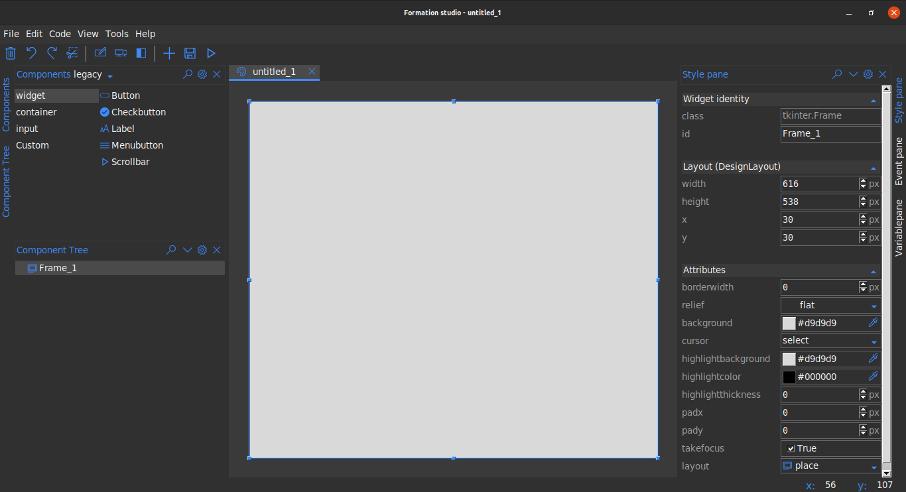
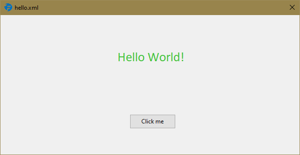

[](https://pypi.org/project/formation-studio/)
[](https://formation-studio.readthedocs.io/en/latest/?badge=latest)

## Introduction

`Formation studio` is a tool that makes developing User interfaces in python a breeze. It allows developers 
to focus on product functionality by doing the heavy lifting in terms of writing the interface code.
Using a set of powerful tools, developers can quickly design interfaces, save them as 
[XML](https://en.wikipedia.org/wiki/XML) files
and load them into their code. Formation studio draws inspiration from other 
[RAD](https://en.wikipedia.org/wiki/Rapid_application_development) tools such as 
[Android Studio's](https://developer.android.com/studio) visual layout editor,
[PAGE](http://page.sourceforge.net). The XML format used is largely similar to one used by
android layout files. It currently support both tkinter and it's ttk extension.

## Getting started
### Installation
To use formation studio you will need to have installed python version 3.6 or higher. You can
download and install python from [here](https://www.python.org/downloads/)
.Proceed then and install formation using pip 
>**Note**: for some linux distributions you will need
to have installed pip separately, follow [these](http://www.techmint.com/install-pip-in-linux/amp/) instructions)

```bash
pip install formation-studio
```
if you have multiple python versions installed, to install for say python 3.7, use its pip tool
```bash
pip3.7 install formation-studio
```

### Launching
After a successful installation you can launch the studio from the command line using the command
```bash
formation-studio
```
The studio will open with a blank design as shown below



You can select widgets from the _**Components**_ pane at the top and drag them onto the stage. Click to
select widgets on the workspace and customize them on _**Stylepane**_ to the right. You can view
your widget hierarchies from the _**Component tree**_ at the bottom left. 
To preview the the design, use the preview ("run button") on the toolbar.
After you are satisfied with the design, save by heading to the menubar _File > Save_. 
Below is a sample studio preview saved as `hello.xml`



The underlying xml uses namespaces and is as shown below:
```xml
<tkinter.Frame 
    xmlns:attr="http://www.hoversetformationstudio.com/styles/" 
    xmlns:layout="http://www.hoversetformationstudio.com/layouts/" 
    name="Frame_1" 
    attr:layout="FrameLayout" 
    layout:width="616" 
    layout:height="287" 
    layout:x="33" 
    layout:y="33">
    <tkinter.ttk.Label 
        name="myLabel" 
        attr:foreground="#44c33c" 
        attr:font="{Calibri} 20 {}" 
        attr:anchor="center" attr:text="Hello World!" 
        layout:width="539" 
        layout:height="89" 
        layout:x="41" 
        layout:y="41"/>
    <tkinter.ttk.Button 
        name="myButton" 
        attr:text="Click me" 
        layout:width="95" 
        layout:height="30" 
        layout:x="266" 
        layout:y="204"/>
</tkinter.Frame>

```
>Note: this xml file has been manually formated to make it more legible but the actual xml file
>is minimally formatted since it's not expected that the developer will need to modify the xml
>file manually

To load the design in your python code is as simple as:

```python
# import the formation library which loads the design for you
from formation import AppBuilder

app = AppBuilder(path="hello.xml")

print(app.myLabel["text"]) # outputs text in the label 'Hello world!'
print(app.myButton["text"]) # outputs text in the button 'Click me'

app.mainloop()
```

>Note: Its advisable that you use widget names that are valid python identifiers to avoid 
>possible issues while use the dot syntax to access the widget from the builder object.
>Use the widgets exact name as specified in the design to avoid `AttributeError`

For more details checkout the [documentation](https://formation-studio.readthedocs.io/en/latest/)
For those wishing to contribute, see the [studio notes](https://formation-studio.readthedocs.io/en/latest/studio/architecture.html) for developers and contributors
Some good documentation for building python user interfaces
include:

- [TkDocs](http://www.tkdocs.com)
- [Graphical User Interfaces with Tk](http://docs.python.org/3.5/library/tk.html)
- [An Introduction to Tkinter](http://effbot.org/tkinterbook/)
- [Tcl/Tk 8.5 Manual](http://www.tcl.tk/man/tcl8.5/) 
