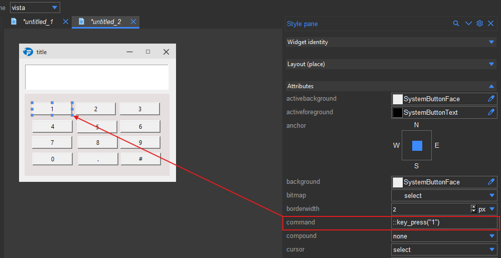

.. _callbacks:

Callbacks
=========

Formation allows you to connect callbacks that will be invoked when a certain
action occurs. These can be set on the following widget attributes:

    * ``command``: Invoked when the widget like a button is clicked.
    * ``validatecommand``: Invoked when the widget like an entry is validated.
    * ``invalidcommand``: Invoked when the widget like a entry is invalid.
    * ``postcommand``: Invoked after a menu is posted.
    * ``tearoffcommand``: Invoked when the a menu is torn off.
    * ``xscrollcommand``: Invoked when the widget like a scrollbar is horizontally scrolled.
    * ``yscrollcommand``: Invoked when the widget like a scrollbar is vertically scrolled.

.. note::

    Some of these command attributes may require a callabck that accepts a number of arguments.
    Before connecting a callback, make sure you know the arguments that the callback will receive.

.. _callback_format:

Callback Format
----------------
To set a simple callback without any arguments you can just use the callback name
as defined in your code

.. code-block:: python

    callback

Or set it as a call with no arguments

.. code-block:: python

    callback()

To pass arguments to a callabck you simply have to use the call format

.. code-block:: python

    callback(arg1, arg2, arg3)

The arguments (``arg1``, ``arg2``, and ``arg3``) will be passed to the callback
You can also pass ``kwargs`` to the callback using the format

.. code-block:: python

    callback(arg1, arg2, arg3, kwarg1=value1, kwarg2=value2)

Any number of arguments and kwargs can be passed to the callback this way.
The arguments can also be expressions that will be evaluated before being passed to the callback.

.. code-block:: python

    callback("SomeText".lower())
    callback(1 + 2, 3 * 4, 5 ** 6)

The function will get the result of the expression as the argument.

You can also pass the widget that triggered the callback as the first argument by prefixing the callback name with ``::``

.. code-block:: python

    ::callback
    ::callback(arg1, arg2, arg3)
    ::callback(arg1, arg2, arg3, kwarg1=value1, kwarg2=value2)

If you have additional arguments, they will be passed after the widget.

.. code-block:: python

    ::callback(20)

.. code-block::

    def callback(widget, value):
        print(widget, value) # <tkinter object> 20

Below is an example where we connect a callabck to each key of a keypad. The callback is a function
named ``key_pressed`` which takes the widget and the value of the key as arguments.

    Connecting a callback to a keypad

The code for the callback is as follows

.. code-block:: python

    def key_pressed(widget, value):
        print(widget, value)
        # do something with the value and widget

.. note::

    The ``::`` prefix is not part of the callback name. It is only used to indicate that the widget
    should be passed as the first argument to the callback.

.. _callback_connect:

Connecting callbacks to your code
---------------------------------

When loading a design from a file, you can connect the callbacks to your code by using the :meth:`~formation.loader.Builder.connect_callbacks` method
of ``Builder``. You can either pass a dictionary with the callback names as keys and the functions as values or pass
an instance of a class that has the callback names as methods.

.. code-block:: python

    ...

    def on_click(event):
        print("button clicked")

    def on_keypress(event):
        print("key pressed")

    # method #1: manual dictionary

    build = Builder(parent, path="my_design.xml")
    build.connect_callbacks({
        "on_click": on_click,
        "on_keypress: on_keypress,
    })

    # method #2: globals() dictionary

    build = Builder(path="my_design.xml")
    build.connect_callbacks(globals())

    ...

.. code-block:: python

    # method #3: class instance

    class App(tkinter.Tk):

        def __init__(self):
            self.build = Builder(self, path="my_design.xml")
            self.build.connect_callbacks(self)

        def on_click(self, event):
            print("button clicked")

        def on_keypress(self, event):
            print("key pressed")

    app = App()
    app.mainloop()
    ...
