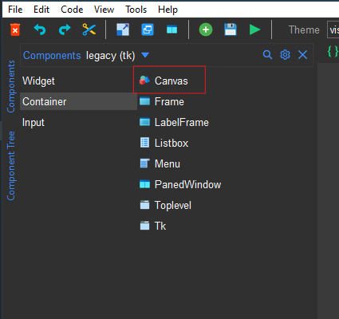
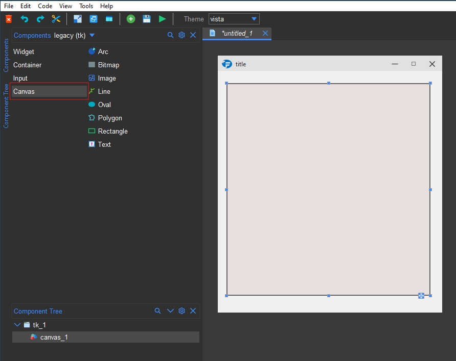
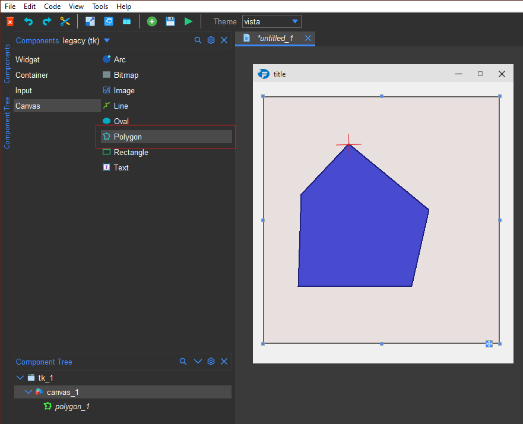
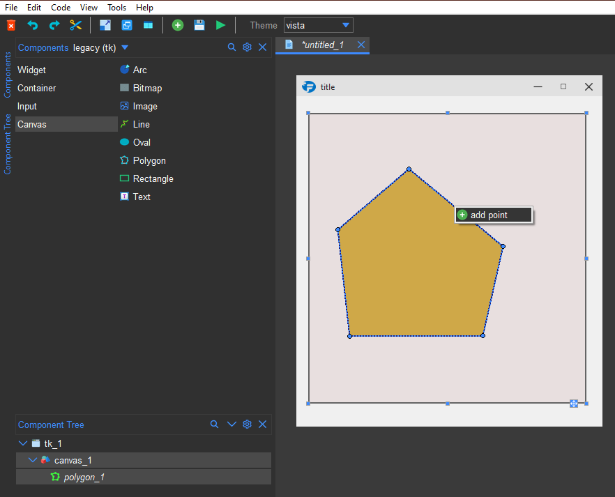
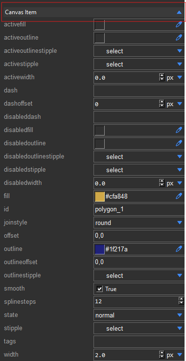
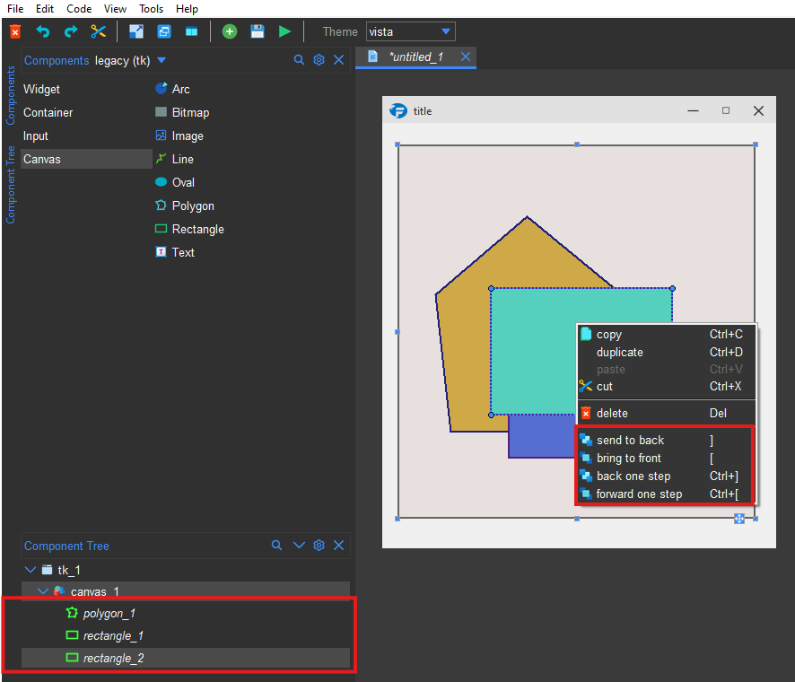

.. _canvas:

Canvas
*******

Setting up
==========

Formation studio allows you to draw on the Tkinter canvas.
To draw on the canvas, you need to first place a canvas on the designer.
The canvas will be in the ``legacy (tk)`` group in the Components pane under ``Container``.

    Canvas component

To place a canvas on the designer, drag and drop the canvas component from the Components pane to the designer.
Once the canvas is placed and selected, The ``Canvas`` section will appear in the Components pane.

    Canvas items

Adding items
============

To draw a canvas item, you need to select the item in the ``Canvas`` section and the cursor on the designer will
change to a crosshair. You can then draw the item on the canvas by clicking and dragging the mouse over the canvas.
For multipoint items like lines and polygons, you can double click to finish drawing the item.

    Drawing a canvas item

Selection, Resizing and Moving
==============================

To switch to selection mode, you can click on the selected item in the ``Canvas`` section to deselect it. Alternatively,
you can ``CTRL + click`` on the canvas to switch to selection mode. In selection mode, the cursor changes from a
cross-hair to a pointer allowing you to select items on the canvas by clicking on them. Once an item is selected,
you can move it by dragging it. For multipoint items like lines and polygons, you can move individual points by
dragging them or add new points by right-clicking on an edge/line and selecting ``add_point``. You can also delete a
point by right-clicking on it and selecting ``remove``. Just like widgets, canvas items can be multi-selected
by ``CTRL + click``.

    Selecting and manipulating canvas items

Styling
=======

The canvas items can be styled using the ``Canvas Item`` section in the Styles pane. The available styles depend on the
type of item selected. If you select multiple items, only the styles that are common to all the selected items will be shown.

    Styling canvas items

Stacking Order
==============

The stacking order of the canvas items can be changed using the context menu.
There are four self-explanatory options available in the context menu:

    * bring to front
    * send to back
    * back one step
    * forward one step

The stacking order can also be adjusted manually by dragging the canvas items in the ``Component tree``.
The higher the item in the tree, the lower it will be in the stacking order.

    Changing stacking order

Accessing the canvas items in code
==================================

Assumming you have a canvas object named ``canvas_1`` and you have drawn a line on it with the item id ``line_1``,
the line object can be manipulated in code as shown below:

.. code-block:: python

    from formation import AppBuilder

    app = AppBuilder(path="hello.xml")

    #access the canvas object
    canvas = app.canvas_1

    #configure the line item
    canvas.itemconfig(app.line_1, fill="red")

    #change coordinates of the line
    canvas.coords(app.line_1, 0, 0, 100, 100)

    app.mainloop()

Generally, the name/id of the item will point to the ``itemid`` that can be used to manipute the item in any of the
canvas item methods.