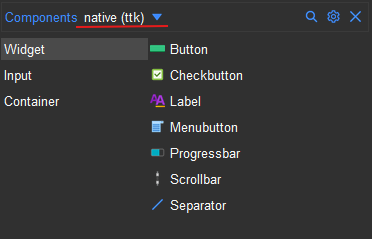

.. _component_pane:

Component Pane
***************

The component pane allows you to access widgets you can put on your design. The
component pane is divided into two major groups:

 * Legacy (classic tkinter widgets)
 * Native (ttk extension widgets)

The widgets are further divided into sub-groups to allow you to easily locate
them based on their functions. These sub-groups are:

 * Container (*widgets that can contain other widgets within them*)
 * Widget (*widgets that have special functionality*)
 * Input (*widgets that allow text and other values to be input*)

More groups may appear depending on what extensions you are using. The `canvas tool <canvas>`_
for example may avail an additional ``canvas`` group with widgets that can
be drawn on a canvas and the menu tool will avail the ``menu`` group.

.. note::

    * You can switch to the group (legacy or native) you want to work with in the drop down
      at the top left of the component pane.
    * To use a widget in your design file, just **drag** it to the design area
    * You can use the search icon at the top of the pane to find a widget
      across all sub-groups with ease.
    * You can mix widgets in Legacy and Native in the same design.

Legacy (tk)
===========

This consists of the classic tkinter widgets. They allow more style attributes
to be set. They look the same on all systems and their default look may seem
outdated but this is made up for by the multitude of style options at your
disposal. Some widgets can only be found in this Legacy group for instance:

* **Listbox** (*displays a list of items*)
* **Canvas**  (*allows flexible drawing of shapes, images and text*)
* **Text**    (*text area allowing multiline text input*)
* **Message** (*label for longer text*)

Native (ttk)
============

This consists of ttk extension widgets. These types of widgets are designed to
be themed and hence don't allow you to modify several style options that were
available in ``legacy``. These widget will look different on different platforms
since they try to look as native as possible to the respective platforms. Some widgets can
only be found in this native group for instance:

* **Treeview** (*displays a items in tabular hierarchical structure*)
* **Sizegrip**  (*a resizable frame*)
* **Combobox**  (*Entry widget allowing selection of values from a list*)
* **Progressbar** (*display progress of a task*)
* **LabeledScale** (*A scale with a built-in label*)

