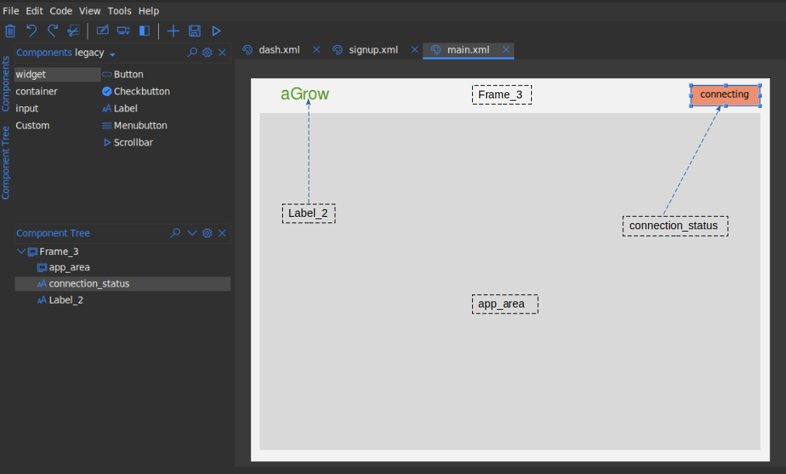
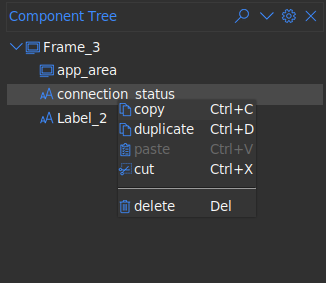

.. _component_tree:

Component Tree
***************

The component tree allows you to view widgets in your design in a hierarchical fashion.
You can select widgets from the component tree by clicking on them. The text
shown on the component tree corresponds to the widget id.

You can also access the widget context menu on the component tree as well.
This menu is the same as what would be shown when you ``right-click`` on the
widget in the design area

.. note::
    * You can use the search icon at the top of the pane to search
      through all widgets in the component tree
    * You can use the collapse/expand icon at the top of the pane to
      collapse or expand all nodes in the component tree.