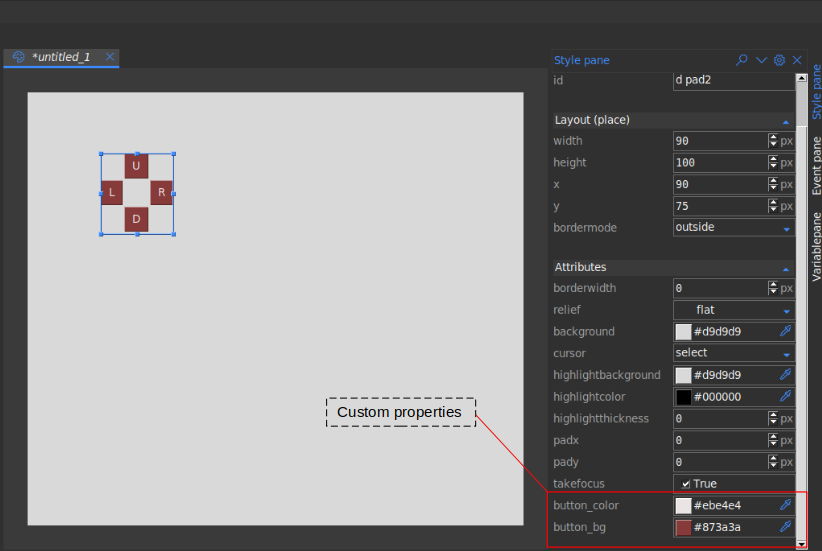

.. _Custom properties:

Custom Properties
******************

Formation studio allows you to specify custom properties for your
:ref:`Custom widgets`. Owing to the adaptive nature of how the studio
handles properties adding custom properties is relatively easy. The studio
relies on proper implementation of the ``configure``, ``keys``, ``cget``,
``__getitem__`` and ``__setitem__`` methods of a widget for  custom properties
to be correctly detected. Luckily, formation provides utilities
to achieve this through the :class:`~formation.utils.CustomPropertyMixin`
Let us add a custom properties `button_color` and `button_bg` to our `Dpad` widget. We will
modify our class to use the :class:`~formation.utils.CustomPropertyMixin`
as shown below

.. code-block:: python

    from tkinter import Frame, Button
    from formation.utils import CustomPropertyMixin

    class DPad(CustomPropertyMixin, Frame):

        prop_info = {
            "button_color": {
                "name": "button_color",
                "default": None,
                "setter": "set_btn_fg",
                "getter": "_btn_fg"
            },
            "button_bg": {
                "name": "button_bg",
                "default": None,
                "setter": "set_btn_bg",
                "getter": "_btn_bg"
            }
        }

        def __init__(self, master, **kw):
            super(DPad, self).__init__(master, **kw)
            self.left = Button(self, text="L", padx=8, pady=5)
            self.right = Button(self, text="R", padx=8, pady=5)
            self.up = Button(self, text="U", padx=8, pady=5)
            self.down = Button(self, text="D", padx=8, pady=5)

            self.up.grid(row=0, column=1)
            self.left.grid(row=1, column=0)
            self.right.grid(row=1, column=2)
            self.down.grid(row=2, column=1)

            self._btns = [self.left, self.right, self.up, self.down]

            self._btn_bg = self.left["bg"]
            self._btn_fg = self.left["fg"]

        def set_btn_bg(self, val):
            for i in self._btns:
                i["bg"] = val
            self._btn_bg = val

        def set_btn_fg(self, val):
            for i in self._btns:
                i["fg"] = val
            self._btn_fg = val

.. note::
    The ``CustomPropertyMixin`` is not necessary if configure, keys and the
    other methods are already implemented to accommodate you custom properties.
    It is however advisable to use the mixin as it has been thoroughly tested and
    is less prone to issues.

Our widget is ready for use. We still need to inform the studio on how
our properties should be handled and what type of values they contain. The studio
supports the following property types:

    * **choice** :  Allows selection from a set of values using a dropdown
      widget. Options are specified as a tuple using the ``options`` key.
    * **boolean** : Selection of true or false using a checkbutton
    * **relief** : Allows selection from the available relief types in tkinter
    * **cursor** : Allows selection from available cursor types in tkinter
    * **bitmap** : Allows selection from the built-in bitmaps
    * **color** : Provides a colorpicker dialog to select colors
    * **text** : Allows entry of arbitrary text
    * **textarea** : Similar to text but allows entry of longer texts.
    * **number** : Entry of integers
    * **float** : Entry of floating point numbers
    * **duration** : Allow entry of durations. You can specify the ``units``
      options which can be one of ('ns', 'ms', 'sec', 'min', 'hrs').
    * **font** : Selection from available system fonts. It also includes a font
      picker that can pick fonts from anywhere within the studio.
    * **dimension** : Entry of dimension. Currently only supports pixels
    * **anchor** : Allows easy setting of anchor and sticky values by providing
      realtime preview of anchor/sticky behaviour on a dummy widget. Setting the
      ``multiple`` option allows the application of multiple anchors simultaneously
    * **image** : Allows user to pick an image from their local machine
    * **variable** : Allows user to select from variables created by the
      ``Variable pane``
    * **stringvariable**: A variation of the variable type that only allows
      selection of ``tk.StringVar``

.. note::
    It is currently not possible to implement your own types but we hope to make
    allow custom types in future.

To specify the types our custom properties, we will modify the meta class as
shown below:

.. code-block:: python

    class DPadMeta(DPad, metaclass=WidgetMeta):
        display_name = 'D Pad'
        impl = DPad
        icon = "gaming"
        is_container = False
        initial_dimensions = 90, 100

        DEF_OVERRIDES = {
            "button_color": {
                "display_name": "button color",
                "type": "color",
                # you can specify additional options supported by type here
                "name": "button_color"
            },
            "button_bg": {
                "display_name": "button bg",
                "type": "color",
                "name": "button_bg"
            }
        }

``DEF_OVERRIDES`` is a special attribute checked at runtime by the studio to
make decisions on what properties to display and how. You can also override
behaviour of default properties by specifying alternative definitions here.

.. note::
    The key and the ``name`` should always match to avoid issues.

Assuming your widget is properly setup as explained in :ref:`Custom widgets`, if
you open the studio and use your custom widget, the custom properties will
appear in the ``attributes`` section on the ``stylepane`` as shown below

