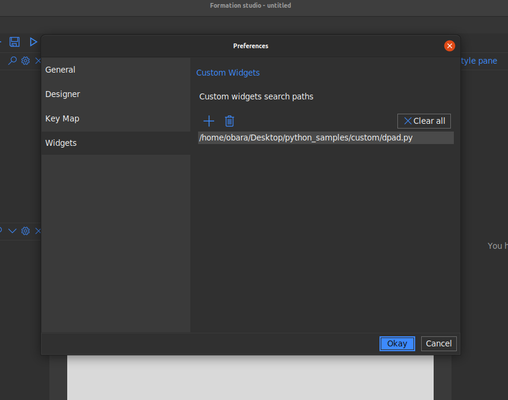
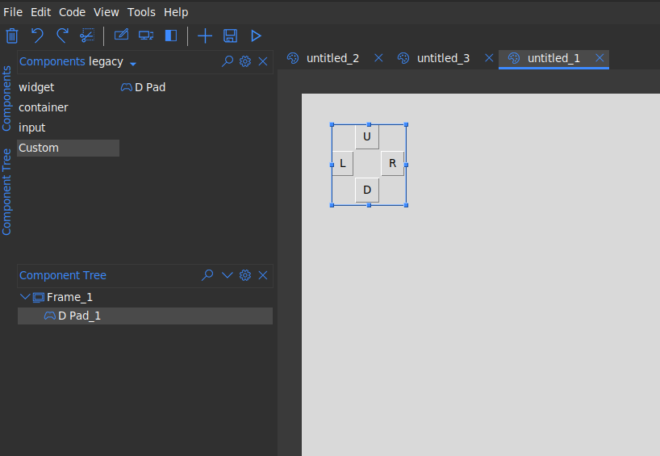
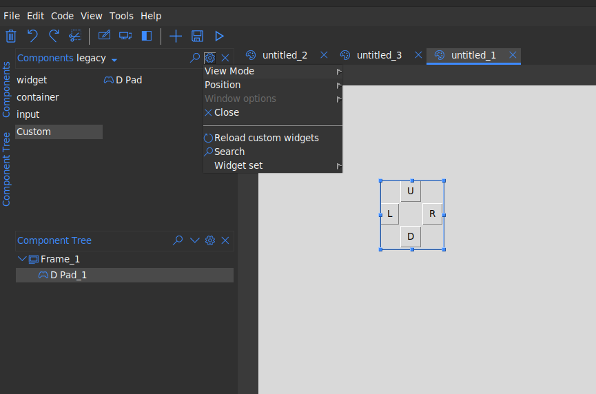

.. _custom_widgets:

Custom Widgets
**************

Introduction
=============
Formation studio provides a way to use your own custom widgets apart from the
builtin widget sets (tk and ttk). The widgets will be treated just as any other
widget allowing you customize it using tools provided by the studio

Setting up
===========
To make your custom widget usable in the studio, you will need to define
a separate class with some metadata required by the studio. This class is what
the studio will manipulate under the hood.
Let us define a simple Custom widget that can be used as a d-pad like one would
find on a game controller

.. code-block:: python

    from tkinter import Frame, Button

    class DPad(Frame):

        def __init__(self, master, **kw):
            super(DPad, self).__init__(master, **kw)
            self.left = Button(self, text="L", padx=8, pady=5)
            self.right = Button(self, text="R", padx=8, pady=5)
            self.up = Button(self, text="U", padx=8, pady=5)
            self.down = Button(self, text="D", padx=8, pady=5)

            self.up.grid(row=0, column=1)
            self.left.grid(row=1, column=0)
            self.right.grid(row=1, column=2)
            self.down.grid(row=2, column=1)

This is a simple compound widget that really just displays the 4 buttons of a
d-pad. To Add this to the studio we would need to define the class with the
metadata. Below are some of the supported metadata.

+------------------+-----------------------+-----------------------------------------------------------+
| Metadata         | default               | Description                                               |
+------------------+-----------------------+-----------------------------------------------------------+
| *display_name*   | name of the meta class| The name used to refer to the widget within the studio    |
+------------------+-----------------------+-----------------------------------------------------------+
| *impl*           | the meta's super class| The custom widget class                                   |
+------------------+-----------------------+-----------------------------------------------------------+
| *is_container*   | False                 | whether the custom widget allows other widgets to be      |
|                  |                       | placed within it.                                         |
+------------------+-----------------------+-----------------------------------------------------------+
| *icon*           | play                  | Text identifier to on of the built in icons to be used as |
|                  |                       | image identifier for the widget                           |
+------------------+-----------------------+-----------------------------------------------------------+

Each of the above metadata is optional and the default will be used if not its
not provided.
To mark the metadata class for use by the studio we need to use the `WidgetMeta`
class provided by the studio. It is a python metaclass and is responsible for
the all the magic that goes on under the hood.
Below is a sample metadata class for a our D-pad widget

.. code-block:: python

    from studio import WidgetMeta

    class DPadMeta(DPad, metaclass=WidgetMeta):
        display_name = 'D Pad'
        # impl is not necessary and can be inferred from the inheritance list
        impl = DPad
        icon = "gaming"
        is_container = False

Connecting to the studio
=========================
We need to configure the path to the file containing our metadata class in the
studio. We head ``Settings > Widgets`` . Click on the ``+`` icon and select
the path to the file with the metadata class. Click ``Okay`` to save the changes.

|

The ``dpad.py`` file used here contains both the implementation and the metadata
but that is not necessary. Only the metadata class is required to be in the file.

.. code-block:: python

    from tkinter import Frame, Button
    from studio import WidgetMeta

    class DPad(Frame):

        def __init__(self, master, **kw):
            super(DPad, self).__init__(master, **kw)
            self.left = Button(self, text="L", padx=8, pady=5)
            self.right = Button(self, text="R", padx=8, pady=5)
            self.up = Button(self, text="U", padx=8, pady=5)
            self.down = Button(self, text="D", padx=8, pady=5)

            self.up.grid(row=0, column=1)
            self.left.grid(row=1, column=0)
            self.right.grid(row=1, column=2)
            self.down.grid(row=2, column=1)

    class DPadMeta(DPad, metaclass=WidgetMeta):
        display_name = 'D Pad'
        impl = DPad
        icon = "gaming"
        is_container = False

Our new custom widget should now be available in the components pane under
the ``custom`` group.

|

Reloading Changes
=================
If any changes are made to metadata class file, you can reload the changes
without having to restart the studio. Just head to the component pane settings
and select ``Reload custom widgets``.

|

.. note::

    Widgets already added to the design pad will not be affected. They will
    continue to use the old definitions until the design is reloaded the
    next time. It is advisable that you remove them before you save the design
    file to avoid nasty issues when reloading them next time.
