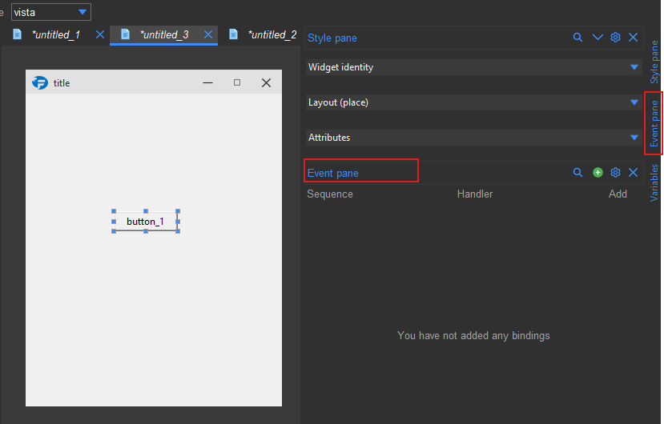
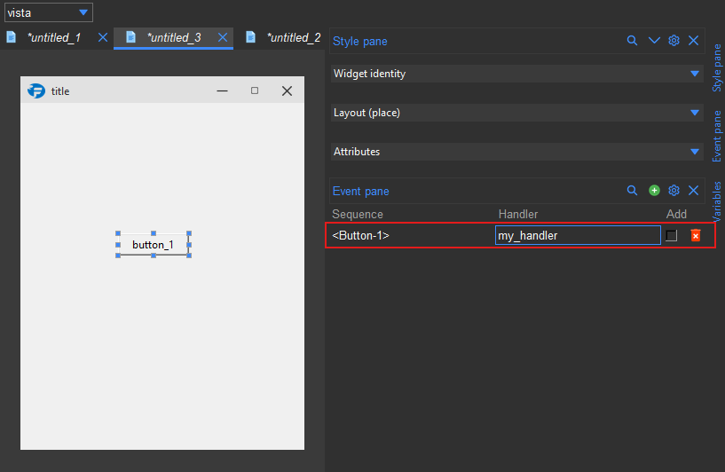

..  _events:

Events
******

The formation studio allows you to bind events to widgets in the Event pane.
You can do this from the event pane accessible as ``Event pane`` from the side bar or the ``View`` menu.

   The Event pane

Adding an event
---------------

To add an event, select the widget(s) to be bound then click on the ``+`` button in the Event pane.
This will add an empty entry in the event table.

   The Event table

The entry has the following fields:

    * **Sequence**: This identifies the type of event to be bound. It has to exactly match any of the event types
      supported by Tkinter for instance ``<Button-1>`` for a left mouse click or ``<Motion>`` for mouse motion.

    * **Handler**: This is the name of the callback function that will be called when the event is triggered. It uses
      the same syntax as the :ref:`command callback <callback_format>`.

    * **Add**: This is a checkbox that allows you to indicate whether the binding should override any existing bindings
      for the same event type. If checked, the new binding will be added to the existing ones, otherwise it will
      replace them.

You can bind as many events as you want to a widget. You can also bind custom events to a widget by using the
format ``<<Custom>>``. You can read more on tkinter events in the `official documentation`

To delete an event, click on the delete icon to the right of the entry.

.. note::

    The callaback passed to the handler will **always receive an event object as its first argument**. If the ``::`` prefix
    is used, the event object will still be passed as the first argument  with the widget argument following it.
    Make sure to account for this in your callback function.

    .. code-block:: python

        def my_handler(event, <other args ...>):
            print(event)

Connecting events to callbacks
------------------------------

You can connect the callbacks to your code by using the :meth:`~formation.loader.Builder.connect_callbacks` method
of ``Builder`` as described in the :ref:`callbacks section <callback_connect>`.