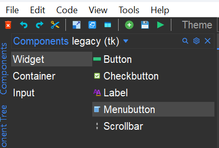
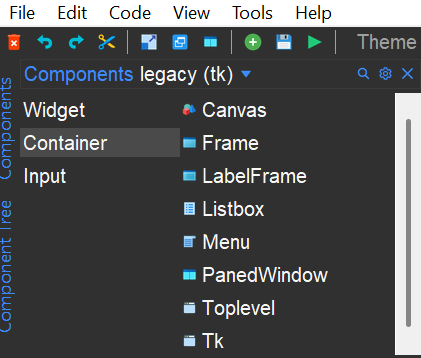
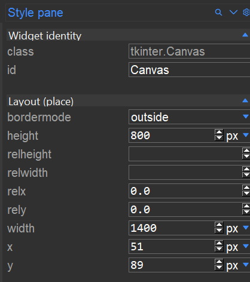
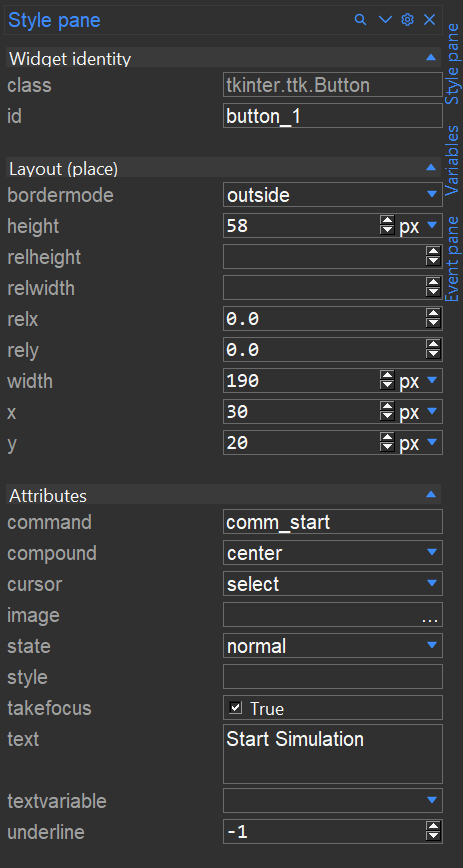
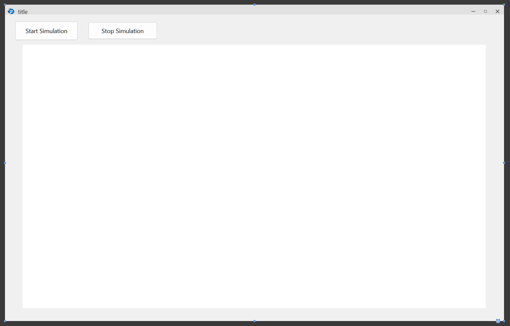
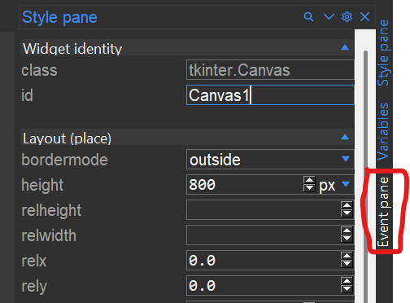
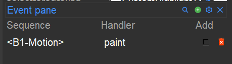

.. CanvasEvents:

Creating a Canvas and using events to draw dots
***********************************************

Setting up
===========

We are going to build a simple application. It will create a GUI with 
a large py:tkinter.canvas 
Using the an event defined in formation-studio, dots will be drawn onto the Canvas
With one of the two buttons on the GUI, a simple "falling motion" of the dots will be simulated
Assuming you already have formation studio installed on your machine 
(if not, see :ref:`installation` instructions) fire up the studio in the terminal as shown below.

.. code-block:: bash

    formation-studio

Creating the design
====================

A blank design will open up assuming you are using default settings. On the
**components** pane on the top left, select ``legacy`` on the drop down menu
to use classic tkinter widgets and not themed ``ttk`` widgets. This will allow
us to customize more attributes.
On the vertical tab on the left, select ``widget`` and drag two times a ``Button`` to the design pad.

`Button` is located in the ``widget`` section. `Canvas` is located in the ``container`` section.

In the ``style pane``, while the ``canvas`` is selected, make some adjustments:

Set the size of the `Canvas` to Height=800 and Width=1400. Adjust the size of the application window if required.
Change the ID to ``Canvas1``, that is important to reference it in the python application.

If needed, change the background color of the ``Canvas`` to make it clearly visible

.. note::
    To **move** a widget around in the editor you will need to hold the `shift` key down when
    dragging. Alternatively you can move the cursor to the edges of the widget after
    selecting it and drag when the "hand" cursor appears.
    To **resize** a widget, drag the small squares at the edges and corners

When selecting one of the 2 `Button` widgets, make the following adjustments in the Style Pane:

Change it text to ``Start simulation``, and change its command to ``comm_start``
Repeat this for the other button, changing its text to ``Stop Simulation`` and its command to ``comm_stop``

The total design should look like:

Next, we are going to create an `event`. This `event` is triggered when Mouse Button 1 is pressed inside the Canvas.
Go to the Event-pane on the left of Formation Stuidio.
If it is not open yet, click the `Event Pane` text on the far left-top

The `Event Pane` opens below the `Style Pane`, and looks like this:

.. figure:: ../_static/examples/CanvasEvent/eventpane.png
    :height: 150px
    :align: center

Make sure you have selected the ``Canvas`` in the design window.
The `Events` that are added in the `Event Pane` are related to the selected design item in the main window.
Each `Event` consists of 2 items, the ``sequence`` and the ``handler``.
The ``sequence`` is about the possible user interactions that can occur.

A partial list of possible `events`, and their meaning, is below. These are TKinter specific, 
more documentation on these `events` can be found on the Tkinter documentation.

* **<Button-1>, <Button-2>, <Button-3>**
    * Button 1 is the leftmost button, button 2 is the middle button(where available), and button 3 the rightmost button. These events are related to the correseponing pressing of the mouse buttons

* **<B1-Motion>**
    * The mouse is moved, with mouse button 1 being held down (use B2 for the middle button, B3 for the right button).

* **<ButtonRelease-1>**
    * Button 1 was released. This is probably a better choice in most cases than the Button event, because if the user accidentally presses the button, they can move the mouse off the widget to avoid setting off the event.
* **<Enter>**
    * The mouse pointer entered the widget (this event doesn't mean that the user pressed the Enter key!).
* **<Leave>**
    * The mouse pointer left the widget.
* **a**
    * The user typed an "a". Most printable characters can be used as is. The exceptions are space (<space>) and less than (<less>). Note that 1 is a keyboard binding, while <1> is a button binding.

Connecting Events
=====================

For this example, we will connect a function to a **<B1-Motion>** event for our ``Canvas1``.
The name of the function we will assign is ``paint``.
In the ``Event Pane``, use the small green (plus) to add a `Sequence` and a `Handler`.
For `Sequence` fill in **<B1-Motion>** (including the smaller-than and larger-than characters).
For 'Handler' fill in **paint**. This is the name of the function that a **<B1-Motion>** event will triggered.

The ``Event Pane`` should look like this:

Wrapping up the design
======================

Save the design in `formation-studio` in a filename called: ``Canvas_example.json`` by doing any of the following

* Go to main menu ``File > Save``
* Press ``Ctrl+S``
* Click on the "Floppy disk" icon in the tool bar

Writing the code
=================

In the same folder where ``Canvas_example.json`` is saved, create a python file
named ``Canvass_example.py``.

To load our design file we will need to import formation loaders and load ``Canvas_example.json`` as shown below.
We will use :py:class:`~formation.loader.AppBuilder` which will create a toplevel window for us.
We also need to use the :py:class:`Threading` module, to control the animation that will be created
We also need the :py:class:'sleep' from the time-module.

.. code-block:: python

    from formation import AppBuilder
    from time import sleep
    import Threading

    app = AppBuilder(path="Canvas_example.json")
    app.connect_callbacks(globals()) 

First we need to define a number of variables. This is possible in `formation-studio`, but we need some specific type of variables.

.. code-block:: python

    app.listofdots=[]  ### an empty list for the dots
    app.stop_event = threading.Event()  ## a stop-Event

The ``listofdots`` variable is of type `list`. It is created as part of the ``class`` `app`, which makes it basically a global variable.
The ``stop_event`` variable is of the type `Event` from the :py:class:`Threading`. By making this part of the ``class`` `app` it is also a global variable.

Now, we need to define 3 functions, one for each of the two ``Buttons`` and one for the **<B1-Motion>** event that was defined on the Canvas1.
First, the ``start button``:

.. code-block:: python

    def comm_start():
        app.stop_event.clear() 
        app.move_thread = threading.Thread(target=dotsfall) 
        app.move_thread.start()
    return

The ``start button`` command does 3 things:

#. Clear the `stop_evet`, just in case it was already stopped
#. Create a Thread, referring to a function called ``dotsfall``
#. Start the Thread that was just created

.. note::
    Tkinter, and with that also Formation.Appbuilder and Formation-studio are event-driven applications. To have a continuous
    flow or execution of a certain funcion, ``Threading`` is required. If a much mode simple :py:class: `while` loop is used, the 
    rest of the application will get into lockout and become unresponsive until the `while` loop ends 

The ``stop button`` function looks like this:

.. code-block:: python
    
    def comm_stop():
        app.stop_event.set()
    return

It does only one thing, which is raising the stop_event flag.

Next is the ``paint`` function, which is linked to the **<B1-Motion>** event on the Canvas:

.. code-block:: python
    
    def paint(event):
        python_green = "#476042"
        x1, y1 = (event.x - 1), (event.y - 1) 
        x2, y2 = (event.x + 1), (event.y + 1) 
        ID=app.Canvas1.create_oval(x1, y1, x2, y2, fill=python_green) 
        app.listofdots.append([ID,1])
    return

The ``paint`` function is called, and the `event`-variable is included in the function call.
Within the function, a couple of things happen:

#. we define a color, called ``python_green``
#. Two coordinates (x1 and y1) for the top-left position of the dot that will be drawn are determined. This is just 1 pixel left and 1 pixel above the coordinates where the user is clicking in the ``Canvas``
#. Two coordinates (x2 and y2) for the bottom-right position of the dot, just 1 pixel right and 1 pixel below the mouse-click
#. Create a circle (`Tkinter.Canvas.Create_oval`)m with given 2 sets of coordinates (x1, y1, x2 and y2) and the color. This draws a dot approximately 3 pixels wide. 
#. A list is created consisting of the `ID`-identifier of the Oval and a ``speed`` indicator (=1). This 2-item list is added to the `app.listofdots`-list.

The list `app.listofdots` is used to control the movement of the dots using the `dotsfall`-function.

.. note::
    When drawing on a `Tkinter.Canvas`, it is up to the creator of the application whether or not
    the item that has been drawn needs to be referenced again.
    Both of the following implementations are correct:

    #. ID=app.Canvas1.create_oval(x1, y1, x2, y2, fill=python_green) 
    #. app.Canvas1.create_oval(x1, y1, x2, y2, fill=python_green)
    
    In the first, the `ID`-identifier can (and in this example will) be used to reference the circle again. In the second implementation this is
    impossible, but in many cases also not required.

The `dotsfall`-function is the last to be defined. It is quite complex, so lets take it step by step.
The following is the minimal-working function, although its effects are not entirely what we want.

.. code-block:: python
    
    def dotsfall():
        while not app.stop_event.is_set(): 
            for j in app.listofdots:  
                ID=j[0] 
                speed=j[1]  
                app.Canvas1.move(ID,0,speed) 
                speed+=1  
            app._root.after(50) 
        app._root.update()
        return

The follwing is happening:

#. A `while`-loop is created, which runs as long as the `app.stop_event` is not `set`.
#. Within the `while`-loop, there is a `for`-loop, going over the `app.listofdots`
#. Within the `for` loop, the `ID` of each Circle and the `speed` of each oval is read from the list
#. The corresponding `Canvas1` item, the circles, are moved in Y+ direction (down)
#. The speed is increased by one.
#. After moving all objects on the `Canvas1`, the Threading event are temporarily stopped for 50ms, so that the GUI can be updated. Using `app._root` it is possible to directly address `TKinter` methods and functions
#. After the `while` loop, the total GUI is forced to be updated using `app._root.update()`

Some additional things need to happen during this function:

#. The `app.listofdots` list needs to be updated after movement. For this, a temporary, local second list is introducted: `listofdots2`
#. In case of a large number of dots, the `stop_event` needs to break the `for`-loop
#. In case of a large number of dots, the `app._root.after()` needs to be shorter to keep the movement even.

The updated, total function looks like this:

.. code-block:: python
    
    def dotsfall():
        listofdots2=[]  
        while not app.stop_event.is_set():  ## continue movement until stop_event
            for j in app.listofdots: 
                if app.stop_event.is_set():
                    break
                ID=j[0]  
                speed=j[1] 
                app.Canvas1.move(ID,0,speed) 
                speed+=1 
                if app.Canvas1.coords(ID)[1]<800:
                    listofdots2.append([ID,speed]) 
            app.listofdots=listofdots2  
            if len(app.listofdots)>100:   
                waittime=int(max(10,100-(len(app.listofdots)/2/1000)))  
                time.sleep(waittime)  
            else:
                time.sleep(0.050) 
        app._root.update()
        return

Wrapping it up
""""""""""""""""

You can download the full code below, of both the python code and the json-design file:

:download:`calculator.py <https://raw.githubusercontent.com/ObaraEmmanuel/Formation/refs/heads/master/examples/CanvasEvents/Canvas_example.py>`

:download:`calculator.xml <https://raw.githubusercontent.com/ObaraEmmanuel/Formation/refs/heads/master/examples/CanvasEvents/Canvas_example.json>`

Conclusion
============

This was a simple example to show how events are linked to items in the GUI in `formation studio`.
