.. _calculator:

Simple Calculator
******************

Setting up
===========

We are going to be building a simple calculator to familiarise ourselves
with the basic features of formation studio. Assuming you already have
formation studio installed on your machine (if not, see :ref:`installation`
instructions) fire up the studio in the terminal as shown below.

.. code-block:: bash

    formation-studio

Creating the design
====================

A blank design will open up assuming you are using default settings. On the
**components** pane on the top left, select ``legacy`` on the drop down menu
to use classic tkinter widgets and not themed ``ttk`` widgets. This will allow
us to customize more attributes.
On the vertical tab on the left, select ``widget`` and drag one ``Button`` and
one ``Label`` to the design pad.

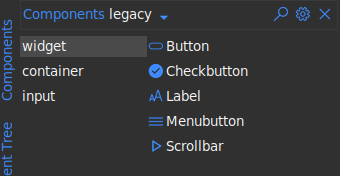

Now select ``input`` on the vertical tab to access
a new set of widgets and drag one ``Entry`` to the design pad.

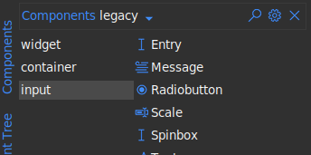

Arrange them as
you please and you should have something as shown below.

.. note::
    To **move** a widget around in the editor you will need to hold the `shift` key down when
    dragging. Alternatively you can move the cursor to the edges of the widget after
    selecting it and drag when the "hand" cursor appears.
    To **resize** a widget, drag the small squares at the edges and corners

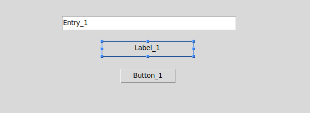

We now set the ``widget id`` of these widgets. This is the most important part
since this is the same id you will use to access the widget in your program. To
set the ``widget id`` use the style pane on the right. The option will always be at
the top in the ``widget identity`` section

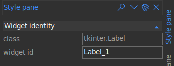

For the purpose of this tutorial, set the ``widget id`` for the widgets added
above as follows

* For the `Entry` widget set ``widget id`` to **expr**
* For the `Label` widget set ``widget id`` to **result**
* For the `Button` widget set ``widget id`` to **calculate**

Double click the ``Label`` and the ``Button`` and change the texts as shown below.
Leave the label blank since we will display the results of the calculations
here.

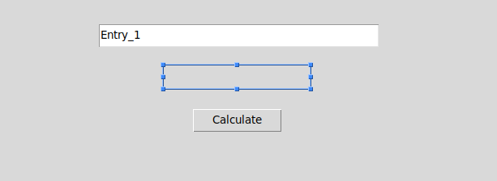

Alternatively, you can use the style pane to set the text attribute along with
other style options you deem fit. The style pane as a whole is divided into 3
main parts

* **Widget identity** : contains the class and the id of the widget
* **Layout** : contains options that control the positioning the widget within its parent.
* **Attributes** : contains options that control the style and other aspects of the widget

Play around with the styles to achieve your desired look. Try changing the colors and
fonts. The design can look however you want.

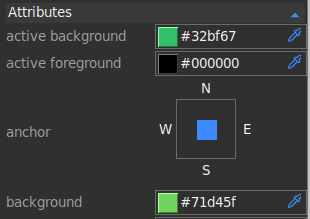

.. note::
    When selecting color, you can use the dropper on the right to select color from anywhere on your screen.
    The colored box on the left can be used to bring up the color picker to allow you
    more fine-grained control over the color. You can also type your desired color name
    directly on the color entry box.

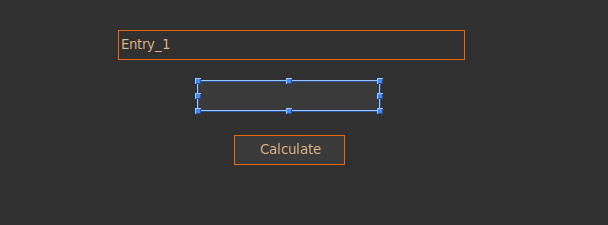

Connecting Variables
=====================

To access values from our ``Entry`` we will need to connect a variable to it. We
can then access the value contained in the entry through the variable.
To add a variable, on the right edge of the studio, select ``Variablepane``. A
new tool pane will open. Click on the "plus" icon at the top right and select
``String`` on the drop down menu. A new ``String`` variable will be created as
shown below. Set the name to ``expr_var``. Once again, this is an important value
and will be used to access the variable in your program.

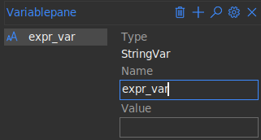

Now select our ``Entry`` widget in the design pad and search through the
``attributes`` section of the stylepane for the ``textvariable`` option. We
have only created one variable named ``expr_var`` so select that.

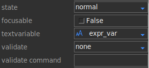

.. note::
    Once a variable has been created in the **VariablePane** it can be connected
    to multiple widgets through the ``variable`` and ``textvariable`` options allowing
    you to control the value in multiple widgets with just one variable.

Connecting Commands
====================

There are two ways of connecting commands in formation studio. We'll start with
the easiest one

.. note::
    Pick only one of the methods below (preferably the first one) since they basically do the same thing
    in different ways. The second method is more advanced and can be used to achieve
    more complex bindings.

1. Using the **command** option
"""""""""""""""""""""""""""""""""

This is the easiest method. It is however limited and can only bind click events to
buttons and other widgets with the ``command`` option. To bind a command, simply
enter the name of the function to be called when the **calculate** ``Button`` is
clicked. This is the same name we will use when defining our callback function
so for the sake of the tutorial lets call it ``calculate``

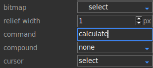

2. Using event bindings
"""""""""""""""""""""""""""""""""

This method can be used to bind all sorts of events since it uses tkinter's ``bind``
method under the hood. The binding is done pretty much the same way. To bind first
select the **calculate** ``Button`` then open the ``Eventpane`` from the right
edge of the studio. Click the "plus" icon at the top right of the pane to add a
new event binding. Then fill out the ``Sequence`` and
``Handler`` as shown below.

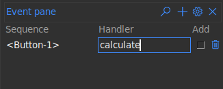

Wrapping up the design
======================

Save the design file as ``calculator.xml`` by doing any of the following

* Go to main menu ``File > Save``
* Press ``Ctrl+S``
* Click on the "Floppy disk" icon in the tool bar

Writing the code
=================

In the same folder where ``calculator.xml`` is saved, create a python file
named ``calculator.py``.
To load our design file we will need to import formation loaders and load ``calculator.xml`` as shown below.
We will use :py:class:`~formation.loader.AppBuilder` which will create a toplevel window for us.
If you wanted to only load a section and code the rest of the app yourself you
would use :py:class:`~formation.loader.Builder` instead.

.. code-block:: python

    from formation import AppBuilder

    app = AppBuilder(path="calculator.xml")

Now let's define our ``calculate`` function which we are to link to the app. This
function will be called when the **calculate** ``Button`` is clicked

.. code-block:: python

    def calculate(event=None):
        # event parameter needs to be there because using the bind method passes an event object
        # access the expr_var we created earlier to determine the current expression entered
        expr = app.expr_var.get()

        # evaluate the expression
        try:
            result = eval(expr)
        except Exception:
            # if the expression entered was malformed and could not be evaluated
            # we will display an error message instead
            result = "Invalid expression"

        # display the result
        app.result.config(text=result)

We will now connect the ``calculate`` function to our app

.. code-block:: python

    app.connect_callbacks({"calculate": calculate})

Alternatively, since the function is in the global scope, you can connect it
directly using python's :py:func:`globals` function

.. code-block:: python

    app.connect_callbacks(globals())

Now everything is done we can fire app our app's ``mainloop`` to get the app running

.. code-block:: python

    app.mainloop()

Wrapping it up
""""""""""""""""

The complete code to run our app which will be located at ``calculate.py`` will be

.. code-block:: python
    :linenos:

    from formation import AppBuilder

    app = AppBuilder(path="calculator.xml")

    def calculate(event=None):
        # event parameter needs to be there because using the bind method passes an event object
        # access the expr_var we created earlier to determine the current expression entered
        expr = app.expr_var.get()

        # evaluate the expression
        try:
            result = eval(expr)
        except Exception:
            # if the expression entered was malformed and could not be evaluated
            # we will display an error message instead
            result = "Invalid expression"

        # display the result
        app.result.config(text=result)

    app.connect_callbacks(globals())

    app.mainloop()

:download:`calculator.py <https://raw.githubusercontent.com/ObaraEmmanuel/Formation/refs/heads/master/examples/calculator/calculator.py>`

:download:`calculator.xml <https://raw.githubusercontent.com/ObaraEmmanuel/Formation/refs/heads/master/examples/calculator/calculator.xml>`

You can now run ``calculator.py`` and it should display your beautiful working app. Type
a simple mathematical expression in the entry box and click "calculate" and it should display the
computed result

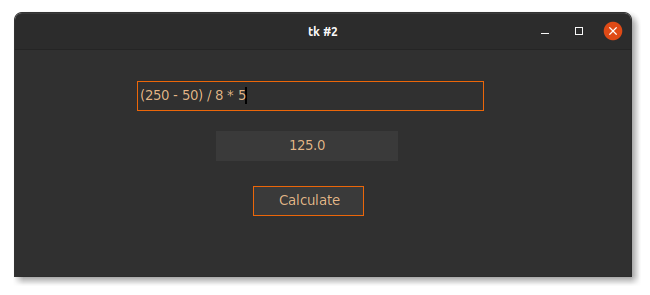

Conclusion
============

This was a simple example to get you started. You can learn to build more
complex applications using the vast number of widgets available with just about
the same ease as building the one in this tutorial. You can find the detailed
API reference for formation loaders used above in the :ref:`loader` section.