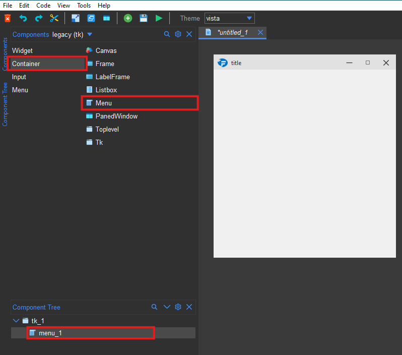
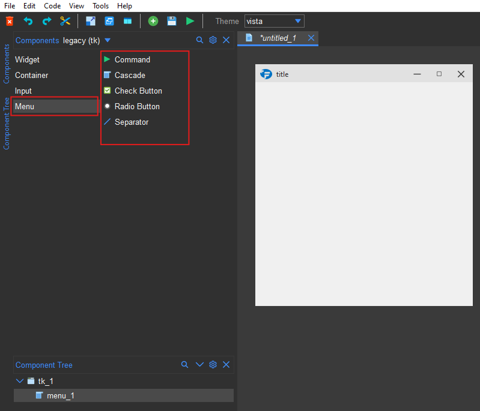
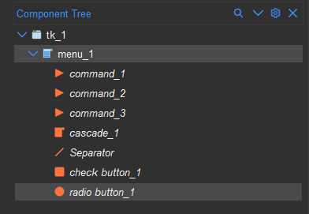
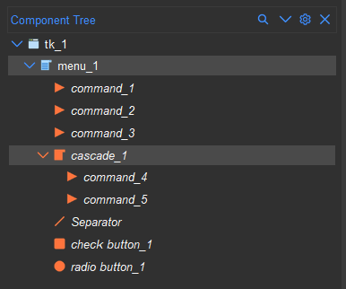
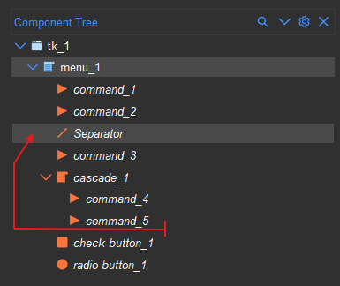
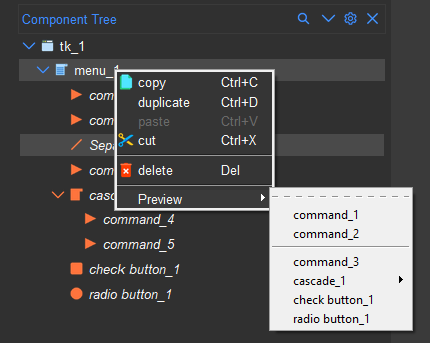
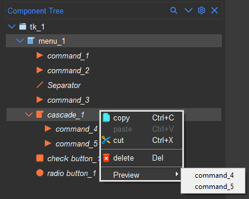
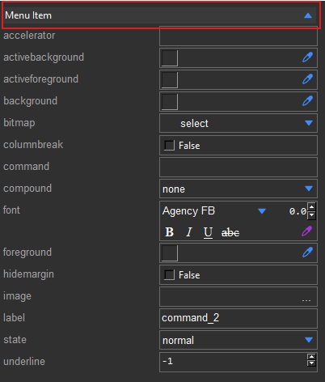
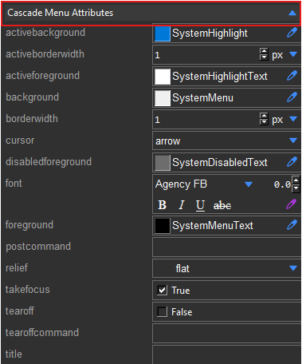
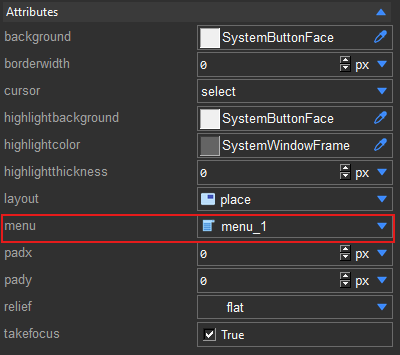

.. _menu:

Menus
******

Formation provides a simple way to create menus. You can add a menu by dragging the menu component from the
components pane to the designer. The menu component will be in the ``legacy (tk)`` group under ``Container``.

.. note::
    Note. The menu component is a non-visual component and will only be visible in the component tree.

    Menu Component

Adding Menu Items
==================

Once the menu has been added and selected in the component tree, the ``Menu`` section will be displayed in the
components pane.

    Menu Component Group

The menu allows addition of 5 types of sub-items:

* **Command** - A menu item that will execute a command when clicked.
* **Cascade** - A menu item that will display a submenu when clicked.
* **Checkbutton** - A menu item that will toggle a checkmark when clicked.
* **Radiobutton** - A menu item that will toggle a radio button when clicked.
* **Separator** - A separator line between menu items.

With the menu selected, click on the item type you want to add. The item will be added to the menu

    Menu Items Added

To add items to a cascade menu, select the cascade item in the component tree and click on the item type you want to
add from the component pane.

.. tip::
    You can add items to multiple cascade menus at the same time by selecting multiple cascade
    items in the component tree.

    Cascade Menu Items Added

Repositioning Menu Items
========================

To reposition a menu item, select the item in the component tree and drag it to the desired position.
You can also reposition multiple items at the same time this way.

    Repositioning Menu Items

Previewing Menus
================

To preview the menu, right-click on the menu component in the component tree and select ``Preview``.
You can also preview a specific cascade menu by right-clicking on the cascade item in the component tree
and selecting ``Preview``.

Styling Menu Items
==================

You can style the menu items by selecting the item in the component tree and changing the properties in the ``Menu Item``
section of the style pane. When multiple items are selected, the properties that are common to all the selected items
will be displayed in the style pane.

    Styling Menu Items

You can also style the underlying cascade menu in the ``Cascade Menu Attributes`` section of the style pane.

    Styling Cascade Menu

Connecting a menu to a widget
=============================

The menu can be connected to a widget by setting the ``menu`` attribute of the widget to the menu component. Widgets
that support menus are:

    * ``Tk``
    * ``Toplevel``
    * ``Menubutton``

Setting the menu attribute of toplevel widget will create a menubar.

    Menu attribute

.. note::
    The menu component must be a descendants of the widget for the menu to be displayed. When setting the menu attribute
    of a widget, only menus that are descendants of the widget will be displayed on the dropdown.