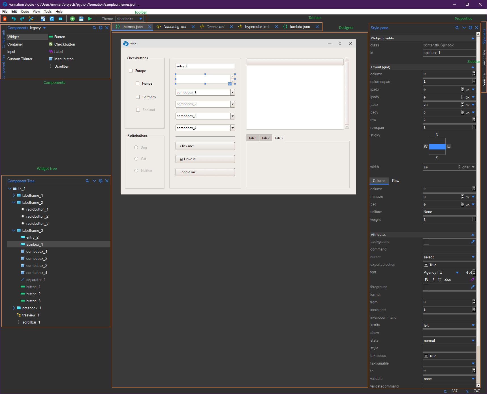

.. _studio_window:

The Studio
**************

    Studio Window

The studio window is separated into the following sections:

1. **Toolbar**: The toolbar contains buttons for common actions such as opening a new project, saving a project, and running the project.
The toolbar also contains buttons for cutting, copying, and pasting selected nodes, as well as buttons for undoing and redoing actions.

2. **Tab Bar**: The tab bar contains tabs for each open UI file. Clicking on a tab will switch to that UI file.
You can also close tabs by clicking the close button on the right side of the tab. The tabs can be dragged to reorder them.

3. **Designer**: The designer is where you can visually design your UI. You can drag and drop widgets from the components pane onto the designer to add them to your UI.
Once on the designer, you can move, resize, and configure the widgets as needed.

4. :ref:`Components Pane<component_pane>`: The components pane contains a list of all the available widgets that you can add to your UI grouped accordingly.
You can drag and drop widgets from the components pane onto the designer to add them to your UI.

5. **Properties/Styles Pane**: The properties/styles pane displays the properties and styles of the currently selected widget.
This can vary depending on the widget type and layout.

6. :ref:`Widget/Component Tree<component_tree>`: The widget/component tree displays the hierarchy of widgets in your UI.
You can select widgets in the tree to select them in the designer.

7. **Sidebar**: The sidebars provide access to the various panels such as the properties/styles pane, widget/component tree, and the components pane.
Currently open panels are highlighted in blue while other available but hidden panels are shown in white.

.. tip::
    You can open a design file by dragging it onto the designer