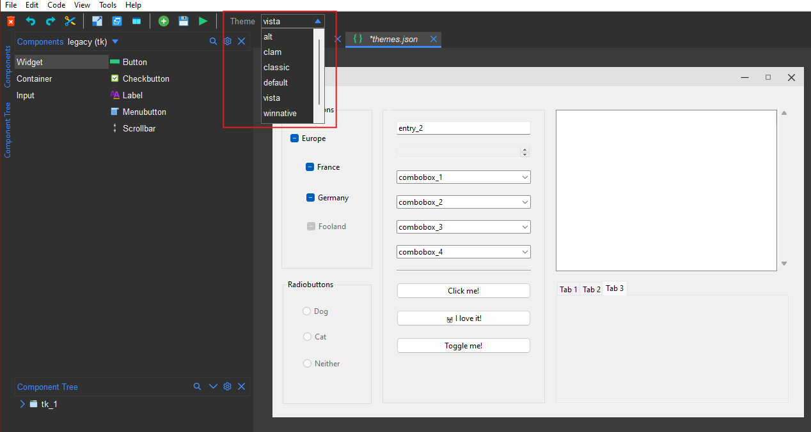

.. _themes:

Themes
******

Formation allows you to customize the look and feel of your application when using ttk widgets.
You can access the themes using the ``Theme`` dropdown in the toolbar.

   Themes

.. note::

    The applied theme will only affect ttk widgets.

The dropdown will display available themes for the operating system in use.
The following third party themes are also supported:

`TTK Themes <https://ttkthemes.readthedocs.io/en/latest/themes.html>`_
-----------------------------------------------------------------------

All `ttkthemes <https://ttkthemes.readthedocs.io/en/latest/themes.html>`_ are supported. To use ttk themes, install the ``ttkthemes`` package
and the themes will be available in the dropdown.

.. code-block:: bash

    pip install ttkthemes

`Sun Valley TTK Theme <https://github.com/rdbende/Sun-Valley-ttk-theme>`_
---------------------------------------------------------------------------

To use the `Sun Valley TTK theme <https://github.com/rdbende/Sun-Valley-ttk-theme>`_, install the ``sv-ttk`` package and the theme will be available in the dropdown.
This includes both light and dark modes.

.. code-block:: bash

    pip install sv-ttk