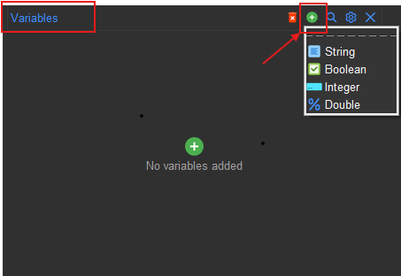
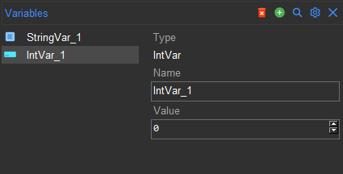
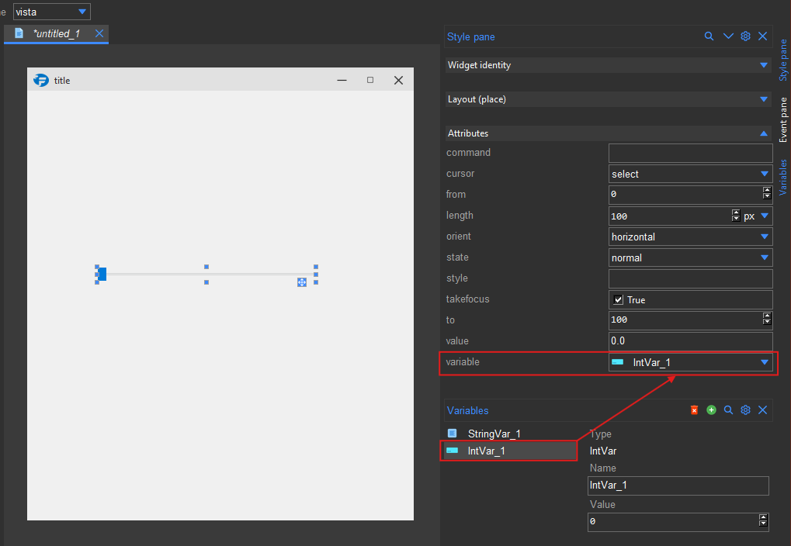
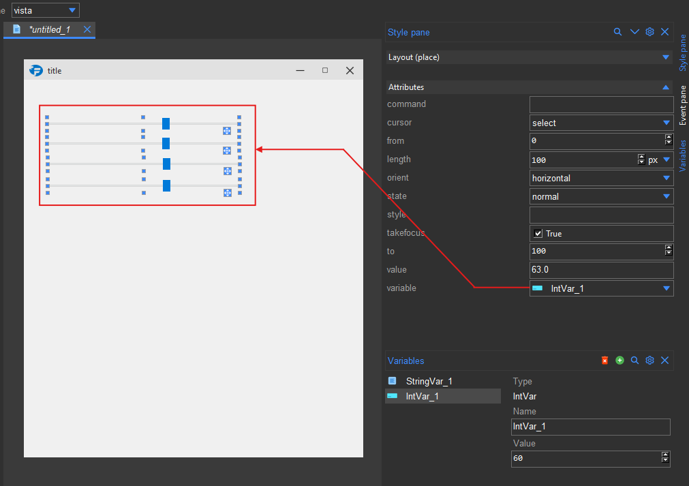

.. _variables:

Variables
*********

Adding variables
================

Formation allows you to define and connect tk variables to your widgets.
You can do this from the variable pane accessible as ``Varibles`` from the side bar or the ``View`` menu.
You can then add variables using the ``+`` button at the top of the pane.

    Variables pane

.. tip::

    To add multiple variables without having to click on the ``+`` button each time, you can tear off the
    menu by clicking on the dashed line at its top so the menu is always visible as a window.

There are four types of variables you can add:

    * ``IntVar``
    * ``DoubleVar``
    * ``StringVar``
    * ``BooleanVar``

Once you have added a variable, you can select it to view more details about it.
These details include:

    * ``Type`` The type of the variable which can be any of the four mentioned above.
    * ``Name``: The variable's name which you can use to reference it in your code.
    * ``Value``: The variable's value which you can change by typing in the text box.

    Variable details

Connecting variables to widgets
===============================

To connect a variable to a widget, you simply set the widget's ``variable`` attribute to the variable. Some widgets
also have the ``textvariable`` or ``listvariable`` attributes, both of which can be set to a variable in a similar way.

.. note::

    ``listvariable`` only works with ``StringVar``.

Here is an example where a `ttk.Scale` widget is connected to an `IntVar` variable:

    Connecting a variable to a widget

With the variable connected, you can now use it to change the widget's value and vice versa.
A single variable can be connected to multiple widgets. This allows you to keep the values of multiple widgets in sync.

    Syncing multiple widgets with a single variable

Accessing variables in your code
================================

To access the value of a variable in your code, you first need to access the variable object using the name you gave it.
You can then use the ``get()`` and ``set()`` methods to get and set the value of the variable respectively.
Assuming you have a variable named ``IntVar_1`` you can access it as follows:

.. code-block:: python

    from formation import AppBuilder

    app = AppBuilder(path="hello.xml")

    # Access the variable
    IntVar_1 = app.IntVar_1

    # Get the value of the variable
    value = IntVar_1.get()
    print(value)

    # Set the value of the variable
    IntVar_1.set(10)

    app.mainloop()

